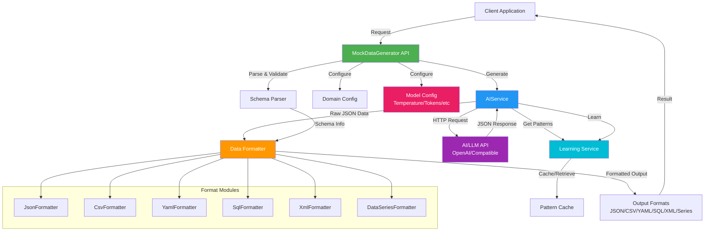
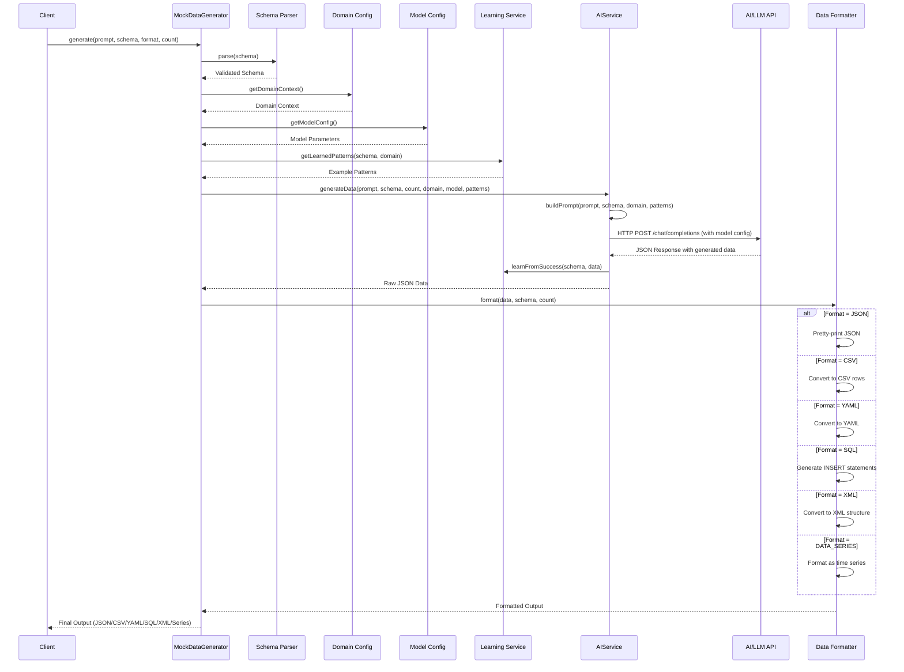

# AI Mock Data Generator

An intelligent mock data generation tool powered by AI that generates realistic test data based on prompts and schemas. Supports multiple output formats including JSON, CSV, YAML, SQL, XML, and data series.

## Key Capabilities

- **AI-Powered Generation**: Uses advanced AI models (GPT-4o, GPT-4o-mini, etc.) to generate realistic, context-aware mock data
- **Fallback Mode**: Works without API key using intelligent rule-based generator (offline, no external dependencies)
- **Flexible Schema Support**: Define complex data structures with arrays, lists, sets, maps, and all numeric types
- **Value Constraints**: Specify validation rules, patterns, enums, and custom criteria for precise data generation
- **Model Configuration**: Fine-tune AI parameters (temperature, tokens, penalties) for different generation styles
- **Learning System**: Pattern learning and caching to improve generation quality over time
- **Domain-Aware**: Pre-configured contexts for ecommerce, healthcare, finance, education, and custom domains
- **Multiple Formats**: Export to JSON, CSV, YAML, SQL, XML, and data series formats
- **Production Ready**: Maven-ready library with comprehensive documentation

## Features

- 🤖 **AI-Powered**: Uses advanced AI models to generate realistic, context-aware mock data
- 🔄 **Fallback Mode**: Works without API key using rule-based generator (offline, no API calls)
- 📋 **Schema-Based**: Define data structure using JSON schemas with value criteria and constraints
- 🎯 **Domain-Aware**: Configure domain-specific contexts (ecommerce, healthcare, finance, etc.)
- 📊 **Multiple Formats**: Support for JSON, CSV, YAML, SQL, XML, and data series
- 🔧 **Model Configuration**: Fine-tune AI model parameters (temperature, tokens, penalties, etc.)
- 🧠 **Learning Features**: Pattern learning and caching to improve generation quality over time
- 📦 **Rich Data Types**: Support for arrays, lists, sets, maps, and all numeric types (int, float, double, long, etc.)
- 🔍 **Value Constraints**: Specify validation rules, patterns, enums, and custom criteria
- 🔧 **Easy Integration**: Simple API for Java applications
- 📦 **Maven Ready**: Ready to publish to Maven Central

## Architecture

The AI Mock Data Generator follows a modular architecture with clear separation of concerns:



### Component Overview

- **MockDataGenerator**: Main API entry point that orchestrates the data generation process
- **AIService**: Handles communication with AI/LLM APIs (OpenAI-compatible)
- **ModelConfig**: Configures AI model parameters (temperature, tokens, penalties, etc.)
- **LearningService**: Manages pattern learning and caching for quality improvement
- **PatternCache**: Stores and retrieves successful generation patterns
- **Schema Parser**: Validates and parses JSON schema definitions with constraints
- **Domain Config**: Provides domain-specific context for data generation
- **Data Formatters**: Convert AI-generated JSON into various output formats
- **Request Builder**: Fluent API for constructing generation requests

## Data Flow

The following diagram illustrates the complete data generation flow:



### Flow Steps

1. **Request Creation**: Client creates a request with prompt, schema, format, and count
2. **Schema Validation**: Schema parser validates the JSON schema structure and extracts constraints
3. **Domain Context**: Domain configuration provides context-specific guidance
4. **Model Configuration**: Model config provides AI parameters (temperature, tokens, etc.)
5. **Pattern Retrieval**: Learning service retrieves relevant patterns from cache (if available)
6. **Prompt Enhancement**: AI service builds an enhanced prompt combining user prompt, schema, domain context, constraints, and learned patterns
7. **AI Generation**: Enhanced prompt is sent to AI/LLM API with model configuration for data generation
8. **Pattern Learning**: Successful generation is stored in pattern cache for future use
9. **Data Formatting**: Raw JSON response is formatted according to the requested output format
10. **Result Return**: Formatted data is returned to the client

## Installation

### Maven

Add the following dependency to your `pom.xml`:

```xml
<dependency>
    <groupId>com.aimockdata</groupId>
    <artifactId>ai-mock-data-gen</artifactId>
    <version>1.0.0</version>
</dependency>
```

### Building from Source

```bash
mvn clean install
```

## Quick Start

### Basic Usage

#### With AI API Key (Recommended)

```java
import com.aimockdata.gen.*;

// Initialize the generator with your API key
MockDataGenerator generator = new MockDataGenerator("your-api-key");

// Define your schema
String schema = "{\n" +
    "  \"properties\": {\n" +
    "    \"name\": {\"type\": \"string\"},\n" +
    "    \"email\": {\"type\": \"string\"},\n" +
    "    \"age\": {\"type\": \"number\"}\n" +
    "  }\n" +
    "}";

// Generate data
String jsonData = generator.generate(
    "Generate realistic user profiles",
    schema,
    OutputFormat.JSON,
    5
);

System.out.println(jsonData);
```

#### Without API Key (Fallback Mode)

The library can generate data **without an API key** using a rule-based fallback generator:

```java
import com.aimockdata.gen.*;

// Initialize generator without API key (uses fallback generator)
MockDataGenerator generator = new MockDataGenerator();

// Or with domain configuration
MockDataGenerator generator = new MockDataGenerator(DomainConfig.ecommerce());

// Define your schema
String schema = "{\n" +
    "  \"properties\": {\n" +
    "    \"name\": {\"type\": \"string\"},\n" +
    "    \"email\": {\"type\": \"string\", \"format\": \"email\"},\n" +
    "    \"age\": {\"type\": \"integer\", \"minimum\": 18, \"maximum\": 100}\n" +
    "  }\n" +
    "}";

// Generate data (works without API key!)
String jsonData = generator.generate(
    "Generate user profiles",
    schema,
    OutputFormat.JSON,
    5
);

System.out.println(jsonData);
```

**Fallback Generator Features:**
- ✅ Works without API key or internet connection
- ✅ Respects schema types and constraints
- ✅ Supports all data types (string, int, float, array, list, set, map, etc.)
- ✅ Handles patterns, enums, min/max values
- ✅ Generates realistic formats (email, dates, phone numbers)
- ✅ Field name-based intelligent generation (email, name, id, etc.)
- ⚠️ Less creative than AI-generated data
- ⚠️ Uses rule-based patterns instead of AI understanding

### Using Domain Configuration

```java
import com.aimockdata.gen.config.DomainConfig;

// Create generator with e-commerce domain
MockDataGenerator generator = new MockDataGenerator(
    "your-api-key",
    DomainConfig.ecommerce()
);

String productSchema = "{\n" +
    "  \"properties\": {\n" +
    "    \"productId\": {\"type\": \"string\"},\n" +
    "    \"name\": {\"type\": \"string\"},\n" +
    "    \"price\": {\"type\": \"number\"},\n" +
    "    \"category\": {\"type\": \"string\"}\n" +
    "  }\n" +
    "}";

String csvData = generator.generate(
    "Generate product catalog data",
    productSchema,
    OutputFormat.CSV,
    10
);
```

### Using Request Builder

```java
MockDataRequest request = new MockDataRequest.Builder()
    .prompt("Generate customer order data")
    .schema("{\"properties\":{\"orderId\":{\"type\":\"string\"},\"total\":{\"type\":\"number\"}}}")
    .outputFormat(OutputFormat.JSON)
    .count(3)
    .build();

String data = generator.generate(request);
```

### Using Value Criteria and Constraints

```java
// Schema with value constraints
String schema = "{\n" +
    "  \"properties\": {\n" +
    "    \"phoneNumber\": {\n" +
    "      \"type\": \"string\",\n" +
    "      \"pattern\": \"^[0-9]{10}$\",\n" +
    "      \"constraints\": \"must be exactly 10 digits\"\n" +
    "    },\n" +
    "    \"age\": {\n" +
    "      \"type\": \"integer\",\n" +
    "      \"minimum\": 18,\n" +
    "      \"maximum\": 100\n" +
    "    },\n" +
    "    \"email\": {\n" +
    "      \"type\": \"string\",\n" +
    "      \"format\": \"email\"\n" +
    "    },\n" +
    "    \"status\": {\n" +
    "      \"type\": \"string\",\n" +
    "      \"enum\": [\"active\", \"inactive\", \"pending\"]\n" +
    "    }\n" +
    "  }\n" +
    "}";

String data = generator.generate(
    "Generate user profiles with validated data",
    schema,
    OutputFormat.JSON,
    5
);
```

### Using Collection Types (Array, List, Set, Map)

```java
// Schema with collection types
String schema = "{\n" +
    "  \"properties\": {\n" +
    "    \"tags\": {\n" +
    "      \"type\": \"array\",\n" +
    "      \"items\": {\"type\": \"string\"},\n" +
    "      \"minItems\": 1,\n" +
    "      \"maxItems\": 5\n" +
    "    },\n" +
    "    \"scores\": {\n" +
    "      \"type\": \"list\",\n" +
    "      \"items\": {\n" +
    "        \"type\": \"integer\",\n" +
    "        \"minimum\": 0,\n" +
    "        \"maximum\": 100\n" +
    "      },\n" +
    "      \"minItems\": 3,\n" +
    "      \"maxItems\": 5\n" +
    "    },\n" +
    "    \"categories\": {\n" +
    "      \"type\": \"set\",\n" +
    "      \"items\": {\"type\": \"string\"},\n" +
    "      \"uniqueItems\": true,\n" +
    "      \"minItems\": 1,\n" +
    "      \"maxItems\": 3\n" +
    "    },\n" +
    "    \"metadata\": {\n" +
    "      \"type\": \"map\",\n" +
    "      \"additionalProperties\": {\"type\": \"string\"}\n" +
    "    }\n" +
    "  }\n" +
    "}";

String data = generator.generate(
    "Generate product data with collections",
    schema,
    OutputFormat.JSON,
    3
);
```

### Using Numeric Types (int, float, double, long)

```java
// Schema with specific numeric types
String schema = "{\n" +
    "  \"properties\": {\n" +
    "    \"id\": {\n" +
    "      \"type\": \"int\",\n" +
    "      \"minimum\": 1,\n" +
    "      \"maximum\": 10000\n" +
    "    },\n" +
    "    \"price\": {\n" +
    "      \"type\": \"float\",\n" +
    "      \"minimum\": 0.01,\n" +
    "      \"maximum\": 999.99\n" +
    "    },\n" +
    "    \"latitude\": {\n" +
    "      \"type\": \"double\",\n" +
    "      \"minimum\": -90.0,\n" +
    "      \"maximum\": 90.0\n" +
    "    },\n" +
    "    \"timestamp\": {\n" +
    "      \"type\": \"long\",\n" +
    "      \"minimum\": 0\n" +
    "    }\n" +
    "  }\n" +
    "}";

String data = generator.generate(
    "Generate location data with precise numeric types",
    schema,
    OutputFormat.JSON,
    5
);
```

### Using Model Configuration and Learning

```java
import com.aimockdata.gen.config.ModelConfig;
import com.aimockdata.gen.ai.learning.LearningService;
import com.aimockdata.gen.ai.learning.PatternCache;

// Create model configuration for creative generation
ModelConfig creativeConfig = ModelConfig.creative();

// Enable learning to improve quality over time
LearningService learningService = new LearningService();

// Create generator with model config and learning
MockDataGenerator generator = new MockDataGenerator(
    "your-api-key",
    DomainConfig.ecommerce(),
    creativeConfig,
    learningService
);

// Generate data (automatically learns from successful generations)
String data = generator.generate(
    "Generate creative product descriptions",
    schema,
    OutputFormat.JSON,
    5
);

// Provide feedback to improve learning
generator.provideFeedback(schema, data, 0.9, "Excellent quality");

// Check learning statistics
PatternCache.CacheStats stats = generator.getLearningStats();
System.out.println("Learned patterns: " + stats.getTotalPatterns());
```

## Use Cases

The AI Mock Data Generator is versatile and can be used in various scenarios. Here are common use cases:

### 1. **Software Testing & QA**

Generate realistic test data for unit tests, integration tests, and end-to-end testing.

```java
// Generate test users for authentication testing
String userSchema = "{\n" +
    "  \"properties\": {\n" +
    "    \"email\": {\"type\": \"string\", \"format\": \"email\"},\n" +
    "    \"password\": {\"type\": \"string\", \"minLength\": 8},\n" +
    "    \"role\": {\"type\": \"string\", \"enum\": [\"admin\", \"user\", \"guest\"]}\n" +
    "  }\n" +
    "}";

String testUsers = generator.generate(
    "Generate test user accounts for authentication",
    userSchema,
    OutputFormat.JSON,
    100
);
```

**Benefits:**
- Eliminates manual test data creation
- Generates diverse, realistic scenarios
- Ensures data consistency across test runs
- Supports edge cases and boundary conditions

### 2. **Database Seeding & Development**

Populate development databases with realistic sample data.

```java
// Generate product catalog for e-commerce development
MockDataGenerator ecommerceGen = new MockDataGenerator(
    apiKey,
    DomainConfig.ecommerce()
);

String productSchema = "{\n" +
    "  \"tableName\": \"products\",\n" +
    "  \"properties\": {\n" +
    "    \"productId\": {\"type\": \"string\", \"pattern\": \"^PROD-[0-9]{6}$\"},\n" +
    "    \"name\": {\"type\": \"string\", \"minLength\": 5, \"maxLength\": 100},\n" +
    "    \"price\": {\"type\": \"float\", \"minimum\": 0.01, \"maximum\": 9999.99},\n" +
    "    \"category\": {\"type\": \"string\"},\n" +
    "    \"inStock\": {\"type\": \"boolean\"}\n" +
    "  }\n" +
    "}";

String sqlData = ecommerceGen.generate(
    "Generate diverse product catalog",
    productSchema,
    OutputFormat.SQL,
    500
);
```

**Benefits:**
- Quick database population
- Realistic data for demos and presentations
- Multiple output formats (SQL, CSV, JSON)
- Domain-specific context for better data quality

### 3. **API Development & Mocking**

Create mock API responses for frontend development and API testing.

```java
// Generate mock API responses
String apiResponseSchema = "{\n" +
    "  \"properties\": {\n" +
    "    \"id\": {\"type\": \"integer\", \"minimum\": 1},\n" +
    "    \"name\": {\"type\": \"string\"},\n" +
    "    \"email\": {\"type\": \"string\", \"format\": \"email\"},\n" +
    "    \"createdAt\": {\"type\": \"string\", \"format\": \"date\"},\n" +
    "    \"tags\": {\n" +
    "      \"type\": \"array\",\n" +
    "      \"items\": {\"type\": \"string\"},\n" +
    "      \"minItems\": 1,\n" +
    "      \"maxItems\": 5\n" +
    "    }\n" +
    "  }\n" +
    "}";

String mockResponse = generator.generate(
    "Generate user profile API response",
    apiResponseSchema,
    OutputFormat.JSON,
    10
);
```

**Benefits:**
- Frontend development without backend dependency
- API contract testing
- Load testing with realistic data
- Consistent mock responses

### 4. **Data Science & Machine Learning**

Generate training datasets and synthetic data for ML models.

```java
// Generate training data for ML models
String trainingDataSchema = "{\n" +
    "  \"properties\": {\n" +
    "    \"features\": {\n" +
    "      \"type\": \"array\",\n" +
    "      \"items\": {\"type\": \"number\"},\n" +
    "      \"minItems\": 10,\n" +
    "      \"maxItems\": 10\n" +
    "    },\n" +
    "    \"label\": {\"type\": \"integer\", \"enum\": [0, 1]},\n" +
    "    \"timestamp\": {\"type\": \"long\"}\n" +
    "  }\n" +
    "}";

String trainingData = generator.generate(
    "Generate diverse training examples",
    trainingDataSchema,
    OutputFormat.CSV,
    1000
);
```

**Benefits:**
- Synthetic data generation for privacy-sensitive scenarios
- Data augmentation for training sets
- Balanced dataset creation
- Feature engineering exploration

### 5. **Documentation & Examples**

Create example data for API documentation, tutorials, and guides.

```java
// Generate example data for documentation
String exampleSchema = "{\n" +
    "  \"properties\": {\n" +
    "    \"orderId\": {\"type\": \"string\", \"pattern\": \"^ORD-[0-9]{8}$\"},\n" +
    "    \"customerName\": {\"type\": \"string\"},\n" +
    "    \"total\": {\"type\": \"float\", \"minimum\": 10.0, \"maximum\": 1000.0},\n" +
    "    \"items\": {\n" +
    "      \"type\": \"array\",\n" +
    "      \"items\": {\n" +
    "        \"type\": \"object\",\n" +
    "        \"properties\": {\n" +
    "          \"product\": {\"type\": \"string\"},\n" +
    "          \"quantity\": {\"type\": \"integer\", \"minimum\": 1}\n" +
    "        }\n" +
    "      }\n" +
    "    }\n" +
    "  }\n" +
    "}";

String examples = generator.generate(
    "Generate realistic order examples",
    exampleSchema,
    OutputFormat.YAML,
    5
);
```

**Benefits:**
- Consistent example data across documentation
- Realistic scenarios for tutorials
- Multiple format support (JSON, YAML, XML)
- Easy updates when schemas change

### 6. **Performance Testing & Load Testing**

Generate large volumes of test data for performance evaluation.

```java
// Generate large dataset for load testing
ModelConfig config = ModelConfig.precise(); // Use precise config for consistency
MockDataGenerator perfGen = new MockDataGenerator(apiKey, DomainConfig.defaultConfig(), config);

String loadTestSchema = "{\n" +
    "  \"properties\": {\n" +
    "    \"userId\": {\"type\": \"string\"},\n" +
    "    \"sessionId\": {\"type\": \"string\"},\n" +
    "    \"timestamp\": {\"type\": \"long\"},\n" +
    "    \"action\": {\"type\": \"string\", \"enum\": [\"login\", \"view\", \"purchase\", \"logout\"]}\n" +
    "  }\n" +
    "}";

String loadTestData = perfGen.generate(
    "Generate user activity logs",
    loadTestSchema,
    OutputFormat.CSV,
    10000
);
```

**Benefits:**
- Large-scale data generation
- Realistic load test scenarios
- CSV format for easy import
- Configurable data volume

### 7. **Data Migration & ETL Testing**

Generate test data for data migration and ETL pipeline validation.

```java
// Generate test data for migration validation
String migrationSchema = "{\n" +
    "  \"properties\": {\n" +
    "    \"legacyId\": {\"type\": \"string\"},\n" +
    "    \"newId\": {\"type\": \"string\"},\n" +
    "    \"data\": {\"type\": \"map\", \"additionalProperties\": {\"type\": \"string\"}},\n" +
    "    \"migrationStatus\": {\"type\": \"string\", \"enum\": [\"pending\", \"completed\", \"failed\"]}\n" +
    "  }\n" +
    "}";

String migrationData = generator.generate(
    "Generate migration test records",
    migrationSchema,
    OutputFormat.JSON,
    1000
);
```

**Benefits:**
- Test data transformation logic
- Validate migration scripts
- Edge case testing
- Data quality validation

### 8. **Healthcare & Compliance Testing**

Generate HIPAA-compliant test data for healthcare applications.

```java
// Generate healthcare test data
MockDataGenerator healthcareGen = new MockDataGenerator(
    apiKey,
    DomainConfig.healthcare()
);

String patientSchema = "{\n" +
    "  \"properties\": {\n" +
    "    \"patientId\": {\"type\": \"string\", \"pattern\": \"^PAT-[0-9]{8}$\"},\n" +
    "    \"diagnosis\": {\"type\": \"string\"},\n" +
    "    \"admissionDate\": {\"type\": \"string\", \"format\": \"date\"},\n" +
    "    \"medications\": {\n" +
    "      \"type\": \"array\",\n" +
    "      \"items\": {\"type\": \"string\"}\n" +
    "    }\n" +
    "  }\n" +
    "}";

String testPatients = healthcareGen.generate(
    "Generate realistic patient records for testing",
    patientSchema,
    OutputFormat.JSON,
    50
);
```

**Benefits:**
- Domain-specific realistic data
- Compliance testing scenarios
- Privacy-safe synthetic data
- Medical terminology accuracy

### 9. **Financial Services Testing**

Generate financial data for banking and fintech applications.

```java
// Generate financial transaction data
MockDataGenerator financeGen = new MockDataGenerator(
    apiKey,
    DomainConfig.finance()
);

String transactionSchema = "{\n" +
    "  \"properties\": {\n" +
    "    \"transactionId\": {\"type\": \"string\", \"pattern\": \"^TXN-[0-9]{12}$\"},\n" +
    "    \"amount\": {\"type\": \"float\", \"minimum\": 0.01, \"maximum\": 100000.0},\n" +
    "    \"currency\": {\"type\": \"string\", \"enum\": [\"USD\", \"EUR\", \"GBP\"]},\n" +
    "    \"timestamp\": {\"type\": \"long\"},\n" +
    "    \"type\": {\"type\": \"string\", \"enum\": [\"debit\", \"credit\", \"transfer\"]}\n" +
    "  }\n" +
    "}";

String transactions = financeGen.generate(
    "Generate realistic financial transactions",
    transactionSchema,
    OutputFormat.CSV,
    1000
);
```

**Benefits:**
- Realistic financial scenarios
- Currency and format compliance
- Transaction type diversity
- Large volume generation

### 10. **Educational & Training**

Create datasets for educational purposes and training exercises.

```java
// Generate educational datasets
MockDataGenerator eduGen = new MockDataGenerator(
    apiKey,
    DomainConfig.education()
);

String studentSchema = "{\n" +
    "  \"properties\": {\n" +
    "    \"studentId\": {\"type\": \"string\"},\n" +
    "    \"name\": {\"type\": \"string\"},\n" +
    "    \"gpa\": {\"type\": \"float\", \"minimum\": 0.0, \"maximum\": 4.0},\n" +
    "    \"courses\": {\n" +
    "      \"type\": \"set\",\n" +
    "      \"items\": {\"type\": \"string\"},\n" +
    "      \"uniqueItems\": true,\n" +
    "      \"minItems\": 3,\n" +
    "      \"maxItems\": 6\n" +
    "    }\n" +
    "  }\n" +
    "}";

String students = eduGen.generate(
    "Generate student records for database course",
    studentSchema,
    OutputFormat.SQL,
    100
);
```

**Benefits:**
- Realistic datasets for teaching
- Multiple output formats for different lessons
- Domain-specific examples
- Scalable data generation

### 11. **IoT & Time Series Data**

Generate sensor data and time series for IoT applications.

```java
// Generate IoT sensor data
String sensorSchema = "{\n" +
    "  \"properties\": {\n" +
    "    \"sensorId\": {\"type\": \"string\"},\n" +
    "    \"timestamp\": {\"type\": \"long\"},\n" +
    "    \"temperature\": {\"type\": \"float\", \"minimum\": -40.0, \"maximum\": 50.0},\n" +
    "    \"humidity\": {\"type\": \"float\", \"minimum\": 0.0, \"maximum\": 100.0},\n" +
    "    \"location\": {\n" +
    "      \"type\": \"object\",\n" +
    "      \"properties\": {\n" +
    "        \"latitude\": {\"type\": \"double\"},\n" +
    "        \"longitude\": {\"type\": \"double\"}\n" +
    "      }\n" +
    "    }\n" +
    "  }\n" +
    "}";

String sensorData = generator.generate(
    "Generate IoT sensor readings",
    sensorSchema,
    OutputFormat.DATA_SERIES,
    1000
);
```

**Benefits:**
- Time series data generation
- Sensor data simulation
- Realistic value ranges
- Data series format support

### 12. **Continuous Integration/CI-CD**

Integrate data generation into CI/CD pipelines for automated testing.

```java
// CI/CD integration example
public class TestDataGenerator {
    private static final String API_KEY = System.getenv("OPENAI_API_KEY");
    private static final MockDataGenerator generator = 
        new MockDataGenerator(API_KEY, DomainConfig.defaultConfig());
    
    public static String generateTestData(String schema, int count) {
        try {
            return generator.generate(
                "Generate test data for CI/CD pipeline",
                schema,
                OutputFormat.JSON,
                count
            );
        } catch (MockDataGenerationException e) {
            throw new RuntimeException("Failed to generate test data", e);
        }
    }
}
```

**Benefits:**
- Automated test data generation
- Consistent test environments
- No manual data setup
- Integration with build pipelines

## Use Case Selection Guide

| Use Case | Recommended Domain | Recommended Format | Model Config |
|----------|-------------------|-------------------|--------------|
| Software Testing | `defaultConfig()` | JSON, CSV | `balanced()` |
| Database Seeding | Domain-specific | SQL, CSV | `balanced()` |
| API Mocking | `defaultConfig()` | JSON | `precise()` |
| ML Training Data | `defaultConfig()` | CSV, JSON | `balanced()` |
| Documentation | Domain-specific | JSON, YAML | `creative()` |
| Load Testing | `defaultConfig()` | CSV | `precise()` |
| Healthcare | `healthcare()` | JSON | `precise()` |
| Finance | `finance()` | CSV, JSON | `precise()` |
| Education | `education()` | SQL, JSON | `balanced()` |
| IoT/Sensors | `defaultConfig()` | DATA_SERIES, CSV | `precise()` |

## Supported Output Formats

### JSON
```java
generator.generate(prompt, schema, OutputFormat.JSON, count);
```

### CSV
```java
generator.generate(prompt, schema, OutputFormat.CSV, count);
```

### YAML
```java
generator.generate(prompt, schema, OutputFormat.YAML, count);
```

### SQL
```java
// Include tableName in schema for SQL output
String schema = "{\n" +
    "  \"tableName\": \"users\",\n" +
    "  \"properties\": {\n" +
    "    \"id\": {\"type\": \"string\"},\n" +
    "    \"name\": {\"type\": \"string\"}\n" +
    "  }\n" +
    "}";
generator.generate(prompt, schema, OutputFormat.SQL, count);
```

### XML
```java
generator.generate(prompt, schema, OutputFormat.XML, count);
```

### Data Series
```java
generator.generate(prompt, schema, OutputFormat.DATA_SERIES, count);
```

## Domain Configurations

Predefined domain configurations are available:

```java
// E-commerce
DomainConfig.ecommerce()

// Healthcare
DomainConfig.healthcare()

// Finance
DomainConfig.finance()

// Education
DomainConfig.education()

// Custom domain
DomainConfig config = new DomainConfig.Builder()
    .domain("logistics")
    .context("Shipping, warehouses, deliveries, tracking")
    .build();
```

## Schema Format

The schema follows JSON Schema format with support for value criteria and constraints, plus extended data types.

**Quick Type Reference:**
- **Primitives**: `string`, `int`, `float`, `double`, `long`, `short`, `byte`, `char`, `boolean`
- **Collections**: `array`, `list`, `set` (with `items` for element type)
- **Maps**: `map`, `object` (with `additionalProperties` for value type)
- **Nested**: `object` with nested `properties`

### Basic Schema

```json
{
  "properties": {
    "fieldName": {
      "type": "string|number|boolean|object|array"
    }
  }
}
```

### Supported Data Types

The schema supports a comprehensive range of data types for flexible and precise data generation:

#### Primitive Types

| Type | Aliases | Description | Example |
|------|---------|-------------|---------|
| **string** | `str` | Text data | `"Hello World"` |
| **integer** | `int` | Whole numbers (32-bit) | `42`, `-100` |
| **number** | - | Generic numeric type | `3.14`, `100` |
| **float** | `single` | Single-precision floating-point (32-bit) | `3.14159f` |
| **double** | - | Double-precision floating-point (64-bit) | `3.141592653589793` |
| **long** | - | Large whole numbers (64-bit) | `9223372036854775807` |
| **short** | - | Small whole numbers (16-bit) | `32767` |
| **byte** | - | Byte values (8-bit) | `127` |
| **char** | `character` | Single character | `'A'` |
| **boolean** | `bool` | True/false values | `true`, `false` |

#### Collection Types

| Type | Aliases | Description | Constraints |
|------|---------|-------------|-------------|
| **array** | `list` | Ordered collection of elements | `minItems`, `maxItems`, `items` (element type) |
| **set** | - | Collection of unique elements | `uniqueItems: true`, `minItems`, `maxItems`, `items` |
| **map** | `object` | Key-value pairs | `additionalProperties` (value type), `minProperties`, `maxProperties` |

#### Complex Types

| Type | Description | Usage |
|------|-------------|-------|
| **object** | Nested object structures | Define nested properties with their own schemas |

#### Type Aliases Reference

The library accepts multiple aliases for convenience:

**String Types:**
- `string` or `str` → generates text data

**Integer Types:**
- `integer` or `int` → generates whole numbers
- `long` → generates large whole numbers (64-bit)
- `short` → generates small whole numbers (16-bit)
- `byte` → generates byte values (8-bit)

**Floating-Point Types:**
- `float` or `single` → generates single-precision decimals
- `double` → generates double-precision decimals
- `number` → generic numeric type (can be integer or decimal)

**Boolean Types:**
- `boolean` or `bool` → generates true/false values

**Character Types:**
- `char` or `character` → generates single characters

**Collection Types:**
- `array` or `list` → generates ordered collections
- `set` → generates unique collections
- `map` or `object` → generates key-value pairs

#### Type Examples

**Primitive Types:**
```json
{
  "properties": {
    "name": {"type": "string"},
    "age": {"type": "int"},
    "price": {"type": "float"},
    "latitude": {"type": "double"},
    "timestamp": {"type": "long"},
    "quantity": {"type": "short"},
    "status": {"type": "byte"},
    "initial": {"type": "char"},
    "active": {"type": "boolean"}
  }
}
```

**Collection Types:**
```json
{
  "properties": {
    "tags": {
      "type": "array",
      "items": {"type": "string"}
    },
    "scores": {
      "type": "list",
      "items": {"type": "integer"}
    },
    "categories": {
      "type": "set",
      "items": {"type": "string"},
      "uniqueItems": true
    },
    "metadata": {
      "type": "map",
      "additionalProperties": {"type": "string"}
    }
  }
}
```

**Nested Objects:**
```json
{
  "properties": {
    "address": {
      "type": "object",
      "properties": {
        "street": {"type": "string"},
        "city": {"type": "string"},
        "zipCode": {"type": "string"}
      }
    }
  }
}
```

#### Complete Data Types Quick Reference

**All Supported Type Names:**

| Category | Supported Types | Notes |
|----------|----------------|-------|
| **Text** | `string`, `str` | Text data with optional length/pattern constraints |
| **Integers** | `integer`, `int`, `long`, `short`, `byte` | Whole numbers of different sizes |
| **Decimals** | `number`, `float`, `single`, `double` | Floating-point numbers |
| **Boolean** | `boolean`, `bool` | True/false values |
| **Character** | `char`, `character` | Single character |
| **Collections** | `array`, `list`, `set` | Ordered or unique collections |
| **Maps** | `map`, `object` | Key-value pairs |
| **Nested** | `object` (with properties) | Nested structures |

**Type Compatibility Matrix:**

| Type | Can be used with | Common Constraints |
|------|------------------|-------------------|
| `string` | `minLength`, `maxLength`, `pattern`, `format`, `enum` | Email, date, URI formats |
| `integer`/`int` | `minimum`, `maximum`, `exclusiveMinimum`, `exclusiveMaximum`, `enum` | Range validation |
| `float`/`double` | `minimum`, `maximum`, `exclusiveMinimum`, `exclusiveMaximum` | Decimal precision |
| `long` | `minimum`, `maximum` | Large number ranges |
| `array`/`list` | `minItems`, `maxItems`, `items` (type), `uniqueItems` | Collection size and element type |
| `set` | `minItems`, `maxItems`, `items` (type), `uniqueItems: true` | Unique collections |
| `map`/`object` | `additionalProperties` (value type), `minProperties`, `maxProperties` | Key-value structures |

### Value Criteria and Constraints

You can specify value criteria and constraints for each field to control the generated data:

#### String Constraints

```json
{
  "properties": {
    "phoneNumber": {
      "type": "string",
      "minLength": 10,
      "maxLength": 10,
      "pattern": "^[0-9]{10}$",
      "description": "10-digit phone number"
    },
    "email": {
      "type": "string",
      "format": "email"
    },
    "ssn": {
      "type": "string",
      "pattern": "^[0-9]{3}-[0-9]{2}-[0-9]{4}$",
      "description": "Social Security Number in format XXX-XX-XXXX"
    },
    "zipCode": {
      "type": "string",
      "pattern": "^[0-9]{5}(-[0-9]{4})?$",
      "description": "US ZIP code (5 digits or 5+4 format)"
    }
  }
}
```

#### Number Constraints

```json
{
  "properties": {
    "age": {
      "type": "integer",
      "minimum": 18,
      "maximum": 100
    },
    "price": {
      "type": "number",
      "minimum": 0.01,
      "maximum": 9999.99
    },
    "quantity": {
      "type": "integer",
      "minimum": 1,
      "exclusiveMaximum": 1000
    }
  }
}
```

#### Enum Constraints

```json
{
  "properties": {
    "status": {
      "type": "string",
      "enum": ["active", "inactive", "pending", "suspended"]
    },
    "priority": {
      "type": "integer",
      "enum": [1, 2, 3, 4, 5]
    }
  }
}
```

#### Custom Criteria

Use the `constraints` or `criteria` field for custom validation rules:

```json
{
  "properties": {
    "accountNumber": {
      "type": "string",
      "constraints": "must be exactly 9 digits",
      "description": "Bank account number"
    },
    "creditCard": {
      "type": "string",
      "criteria": [
        "must be 16 digits",
        "must start with 4, 5, or 6",
        "must pass Luhn algorithm"
      ]
    },
    "userId": {
      "type": "string",
      "minLength": 6,
      "maxLength": 20,
      "pattern": "^[a-zA-Z0-9_]+$",
      "constraints": "alphanumeric and underscore only, no spaces"
    }
  }
}
```

#### Array and List Types

```json
{
  "properties": {
    "tags": {
      "type": "array",
      "items": {
        "type": "string"
      },
      "minItems": 1,
      "maxItems": 10,
      "description": "Array of tag strings"
    },
    "scores": {
      "type": "list",
      "items": {
        "type": "integer",
        "minimum": 0,
        "maximum": 100
      },
      "minItems": 3,
      "maxItems": 5
    },
    "coordinates": {
      "type": "array",
      "items": {
        "type": "number"
      },
      "minItems": 2,
      "maxItems": 2,
      "description": "Array of [x, y] coordinates"
    }
  }
}
```

#### Set Types (Unique Collections)

```json
{
  "properties": {
    "uniqueIds": {
      "type": "set",
      "items": {
        "type": "string"
      },
      "minItems": 1,
      "maxItems": 5,
      "uniqueItems": true,
      "description": "Set of unique identifier strings"
    },
    "categories": {
      "type": "set",
      "items": {
        "type": "string",
        "enum": ["electronics", "clothing", "books", "food"]
      },
      "minItems": 1,
      "maxItems": 3
    }
  }
}
```

#### Map Types

```json
{
  "properties": {
    "metadata": {
      "type": "map",
      "additionalProperties": {
        "type": "string"
      },
      "description": "Map of string key-value pairs"
    },
    "settings": {
      "type": "object",
      "additionalProperties": {
        "type": "number"
      },
      "minProperties": 1,
      "maxProperties": 10
    },
    "config": {
      "type": "map",
      "additionalProperties": {
        "type": "object",
        "properties": {
          "enabled": {"type": "boolean"},
          "value": {"type": "string"}
        }
      }
    }
  }
}
```

#### Numeric Types (int, float, double, long)

```json
{
  "properties": {
    "age": {
      "type": "int",
      "minimum": 18,
      "maximum": 100
    },
    "price": {
      "type": "float",
      "minimum": 0.01,
      "maximum": 9999.99
    },
    "latitude": {
      "type": "double",
      "minimum": -90.0,
      "maximum": 90.0
    },
    "timestamp": {
      "type": "long",
      "minimum": 0,
      "description": "Unix timestamp in milliseconds"
    },
    "quantity": {
      "type": "short",
      "minimum": 1,
      "maximum": 32767
    }
  }
}
```

#### Nested Collections

```json
{
  "properties": {
    "matrix": {
      "type": "array",
      "items": {
        "type": "array",
        "items": {
          "type": "number"
        }
      },
      "description": "2D array of numbers"
    },
    "userGroups": {
      "type": "list",
      "items": {
        "type": "object",
        "properties": {
          "groupId": {"type": "string"},
          "members": {
            "type": "array",
            "items": {"type": "string"}
          }
        }
      }
    }
  }
}
```

#### Complete Example with All Types

```json
{
  "properties": {
    "employeeId": {
      "type": "string",
      "pattern": "^EMP[0-9]{6}$",
      "description": "Employee ID in format EMP######"
    },
    "salary": {
      "type": "float",
      "minimum": 30000.0,
      "maximum": 200000.0,
      "description": "Annual salary in USD"
    },
    "age": {
      "type": "int",
      "minimum": 18,
      "maximum": 65
    },
    "department": {
      "type": "string",
      "enum": ["Engineering", "Sales", "Marketing", "HR", "Finance"]
    },
    "skills": {
      "type": "array",
      "items": {
        "type": "string"
      },
      "minItems": 1,
      "maxItems": 10
    },
    "certifications": {
      "type": "set",
      "items": {
        "type": "string"
      },
      "uniqueItems": true,
      "minItems": 0,
      "maxItems": 5
    },
    "contactInfo": {
      "type": "map",
      "additionalProperties": {
        "type": "string"
      },
      "description": "Map of contact information"
    },
    "phone": {
      "type": "string",
      "pattern": "^\\+1-[0-9]{3}-[0-9]{3}-[0-9]{4}$",
      "constraints": "US phone number in format +1-XXX-XXX-XXXX"
    },
    "hireDate": {
      "type": "string",
      "format": "date",
      "description": "Date in YYYY-MM-DD format"
    }
  }
}
```

### SQL Output Schema

For SQL output, include a `tableName`:

```json
{
  "tableName": "my_table",
  "properties": {
    "id": {
      "type": "string",
      "pattern": "^[A-Z0-9]{8}$",
      "description": "8-character alphanumeric ID"
    },
    "name": {
      "type": "string",
      "minLength": 1,
      "maxLength": 100
    }
  }
}
```

### Supported Constraint Types

- **minLength/maxLength**: String length constraints
- **minimum/maximum**: Numeric value constraints
- **exclusiveMinimum/exclusiveMaximum**: Exclusive numeric bounds
- **pattern**: Regular expression pattern (must match)
- **format**: Predefined formats (email, date, uri, etc.)
- **enum**: Allowed values list
- **constraints**: Custom constraint description (string)
- **criteria**: Custom criteria list (array of strings)
- **description**: Human-readable field description (used as guidance)

## API Reference

### MockDataGenerator

Main class for generating mock data.

**Constructors:**
- `MockDataGenerator(String apiKey)` - Creates generator with default domain config
- `MockDataGenerator(String apiKey, DomainConfig domainConfig)` - Creates generator with custom domain config
- `MockDataGenerator(String apiKey, DomainConfig domainConfig, ModelConfig modelConfig)` - Creates generator with model configuration
- `MockDataGenerator(String apiKey, DomainConfig domainConfig, ModelConfig modelConfig, LearningService learningService)` - Creates generator with full configuration

**Methods:**
- `generate(MockDataRequest request)` - Generate data from request object
- `generate(String prompt, String schema, OutputFormat format, int count)` - Generate data with simple parameters
- `provideFeedback(String schema, String generatedData, double qualityScore, String feedback)` - Provide feedback for learning (qualityScore: 0.0-1.0)
- `getLearningStats()` - Get learning statistics
- `clearLearning()` - Clear all learned patterns

### MockDataRequest

Request object for data generation.

**Builder:**
```java
new MockDataRequest.Builder()
    .prompt(String prompt)
    .schema(String schema)
    .outputFormat(OutputFormat format)
    .count(int count)
    .options(Map<String, Object> options)
    .build()
```

### ModelConfig

Configuration for AI model parameters.

**Static Methods:**
- `ModelConfig.defaultConfig()` - Default configuration
- `ModelConfig.creative()` - High temperature (0.9) for creative generation
- `ModelConfig.precise()` - Low temperature (0.3) for precise generation
- `ModelConfig.balanced()` - Balanced settings (0.7)
- `ModelConfig.forModel(String model)` - Quick setup for specific model

**Builder Methods:**
- `model(String model)` - Set AI model (e.g., "gpt-4o", "gpt-4o-mini")
- `temperature(double temperature)` - Set temperature (0.0-2.0)
- `maxTokens(int maxTokens)` - Set maximum tokens
- `topP(double topP)` - Set top-p sampling (0.0-1.0)
- `frequencyPenalty(int penalty)` - Set frequency penalty (-2 to 2)
- `presencePenalty(int penalty)` - Set presence penalty (-2 to 2)
- `systemPrompt(String prompt)` - Set custom system prompt

### LearningService

Service for learning from data generation patterns.

**Constructors:**
- `LearningService()` - Creates learning service with default settings
- `LearningService(boolean enabled)` - Creates learning service with enabled/disabled flag
- `LearningService(PatternCache patternCache)` - Creates learning service with custom cache

**Methods:**
- `learnFromSuccess(Schema schema, DomainConfig domainConfig, String generatedData)` - Learn from successful generation
- `getLearnedPatterns(Schema schema, DomainConfig domainConfig, int maxExamples)` - Get learned patterns
- `provideFeedback(Schema schema, DomainConfig domainConfig, String generatedData, double qualityScore, String feedback)` - Provide feedback
- `getStats()` - Get learning statistics
- `clearLearning()` - Clear all learned patterns

### PatternCache

Cache for storing and retrieving generation patterns.

**Constructors:**
- `PatternCache()` - Creates cache with default settings
- `PatternCache(boolean enabled, int maxCacheSize)` - Creates cache with custom settings

**Methods:**
- `storePattern(String schemaHash, String domain, String example)` - Store a pattern
- `getPatterns(String schemaHash, String domain, int limit)` - Get patterns
- `getSimilarPatterns(String schemaHash, String domain, int limit)` - Get similar patterns
- `clear()` - Clear all patterns
- `clearDomain(String domain)` - Clear patterns for a domain
- `getStats()` - Get cache statistics

### OutputFormat

Enum of supported formats:
- `JSON`
- `CSV`
- `YAML`
- `SQL`
- `XML`
- `DATA_SERIES`

## Configuration

### API Key

Set your OpenAI API key (or compatible API):

```java
String apiKey = System.getenv("OPENAI_API_KEY");
MockDataGenerator generator = new MockDataGenerator(apiKey);
```

### Model Configuration

Configure AI model parameters for fine-tuned generation:

```java
import com.aimockdata.gen.config.ModelConfig;

// Use predefined configurations
ModelConfig creative = ModelConfig.creative();  // High temperature (0.9) for creative data
ModelConfig precise = ModelConfig.precise();    // Low temperature (0.3) for precise data
ModelConfig balanced = ModelConfig.balanced();  // Balanced settings (0.7)

// Custom model configuration
ModelConfig customConfig = new ModelConfig.Builder()
    .model("gpt-4o")                    // Use GPT-4o model
    .temperature(0.8)                    // Creativity level (0.0-2.0)
    .maxTokens(8000)                     // Maximum tokens in response
    .topP(0.95)                          // Nucleus sampling (0.0-1.0)
    .frequencyPenalty(0)                  // Reduce repetition (-2.0 to 2.0)
    .presencePenalty(0)                  // Encourage new topics (-2.0 to 2.0)
    .systemPrompt("Custom system prompt") // Custom system message
    .build();

// Use with generator
MockDataGenerator generator = new MockDataGenerator(
    apiKey,
    DomainConfig.ecommerce(),
    customConfig
);
```

#### Model Configuration Options

- **model**: AI model to use (e.g., "gpt-4o", "gpt-4o-mini", "gpt-3.5-turbo")
- **temperature**: Controls randomness (0.0 = deterministic, 2.0 = very creative)
- **maxTokens**: Maximum tokens in the response
- **topP**: Nucleus sampling parameter (0.0-1.0)
- **frequencyPenalty**: Reduces repetition of tokens (-2.0 to 2.0)
- **presencePenalty**: Encourages new topics (-2.0 to 2.0)
- **systemPrompt**: Custom system message for the AI

#### Predefined Model Configurations

- `ModelConfig.creative()`: High temperature (0.9) for creative, varied data
- `ModelConfig.precise()`: Low temperature (0.3) for precise, consistent data
- `ModelConfig.balanced()`: Balanced settings (0.7) for general use
- `ModelConfig.forModel("model-name")`: Quick setup for specific model

### Learning Features

The library includes learning capabilities that improve generation quality over time:

```java
import com.aimockdata.gen.ai.learning.LearningService;

// Enable learning (default)
LearningService learningService = new LearningService();

// Disable learning
LearningService learningService = new LearningService(false);

// Custom learning with specific cache size
PatternCache patternCache = new PatternCache(true, 200); // Cache up to 200 patterns
LearningService learningService = new LearningService(patternCache);

// Use with generator
MockDataGenerator generator = new MockDataGenerator(
    apiKey,
    DomainConfig.ecommerce(),
    ModelConfig.balanced(),
    learningService
);
```

#### How Learning Works

1. **Pattern Caching**: Successful generations are cached based on schema and domain
2. **Pattern Retrieval**: Similar schemas retrieve relevant examples to guide generation
3. **Quality Improvement**: Over time, the AI learns from high-quality patterns

#### Providing Feedback

Improve learning by providing feedback on generated data:

```java
// After generating data
String generatedData = generator.generate(prompt, schema, OutputFormat.JSON, 5);

// Provide feedback (quality score 0.0 to 1.0)
generator.provideFeedback(
    schema,
    generatedData,
    0.9,  // High quality score
    "Excellent realistic data"
);

// Low quality feedback (won't be learned from)
generator.provideFeedback(
    schema,
    generatedData,
    0.4,  // Low quality score
    "Data doesn't match requirements"
);
```

#### Learning Statistics

Monitor learning progress:

```java
PatternCache.CacheStats stats = generator.getLearningStats();
System.out.println("Cache keys: " + stats.getKeyCount());
System.out.println("Total patterns: " + stats.getTotalPatterns());
System.out.println("Learning enabled: " + stats.isEnabled());
```

#### Clearing Learning Data

```java
// Clear all learned patterns
generator.clearLearning();

// Or clear for specific domain (via LearningService)
learningService.clearLearning();
```

### Custom AI Service URL

To use a different AI service endpoint:

```java
AIService aiService = new AIService(apiKey, "https://your-api-endpoint.com/v1/chat/completions");
```

## Examples

See `src/main/java/com/aimockdata/gen/ExampleUsage.java` for complete examples.

## Requirements

- **Java 11 or higher**
- **Optional**: Valid API key for OpenAI or compatible AI service
  - **With API key**: AI-powered generation with high-quality, context-aware data
  - **Without API key**: Rule-based fallback generator (works offline, no API calls)

## Dependencies

- Jackson (JSON/CSV/YAML processing)
- SnakeYAML (YAML processing)
- OkHttp (HTTP client)
- Gson (JSON parsing)
- SLF4J (Logging)

## Publishing to Maven

To publish to Maven Central:

1. Configure your `~/.m2/settings.xml` with Sonatype credentials
2. Run:
```bash
mvn clean deploy
```

## License

This project is licensed under the MIT License.

## Contributing

Contributions are welcome! Please feel free to submit a Pull Request.

## Support

For issues and questions, please open an issue on the project repository.

